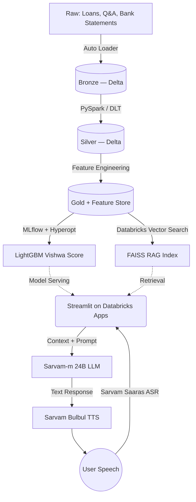

# Vishwa Score — Voice Financial Advisor & Alternative Credit Scoring

> Multilingual voice-based financial advisor and alternative credit scorer for the ~300M credit-invisible Indians. Built on the Databricks Data Intelligence Platform and Sarvam AI voice stack.

[](LICENSE)


**🏆 2nd place — Bharat Bricks Hacks 2026 (₹75,000 prize).**
**🌐 Live app:** https://hello-world-7474647517748637.aws.databricksapps.com

---

## What it does

Rural and unbanked users speak to Vishwa Score in their native language and get:

1. **Personalized government-loan discovery** via a multilingual voice RAG pipeline (Sarvam ASR → FAISS retrieval → Sarvam-m 24B LLM → Sarvam TTS).
2. **An alternative credit score (300–900)** generated by a LightGBM model trained on synthetic UPI/utility/telecom payment data, served from the MLflow Model Registry.
3. **Per-user SHAP explanations** so the score is auditable, not a black box.

---

## Results

| Metric | Value |
| --- | --- |
| BhashaBench Financial Q&A accuracy | **88.4 %** |
| Vishwa Score model AUC | _TODO — fill from `notebooks/model/model_train.ipynb`_ |
| KS statistic | _TODO_ |
| End-to-end voice latency (p50 / p95) | _TODO — instrument_ |
| Users scored (synthetic dataset) | _TODO_ |

> The `TODO` rows are the next thing to fill in — see [docs/ROADMAP.md](docs/ROADMAP.md).

---

## Architecture



---

## Repository layout

```
vishwa-score/
├── app/                        # Streamlit app deployed to Databricks Apps
│   ├── app.py
│   ├── app.yaml
│   └── requirements.txt
├── notebooks/
│   ├── data/                   # Bronze / Silver / Gold Delta pipeline
│   │   ├── synthetic_data_generation.ipynb
│   │   ├── schema_create.dbquery.ipynb
│   │   ├── silver_layer.ipynb
│   │   └── gold_layer.ipynb
│   └── model/                  # Training, tuning, explainability, refresh
│       ├── model_train.ipynb
│       ├── hyperopt_tuning.ipynb
│       ├── shap_explainer.ipynb
│       └── refresh_job.ipynb
├── src/vishwa/                 # (WIP) modular Python package extracted from notebooks
├── docs/                       # Model card, ADRs, roadmap
├── infra/databricks/           # Job JSON, cluster policies
├── tests/                      # pytest
├── .github/workflows/          # CI: lint + tests
├── .env.example
├── pyproject.toml
└── LICENSE
```

---

## Run it locally

```bash
# 1. Clone
git clone https://github.com/aryamanbhati/vishwa-score.git
cd vishwa-score

# 2. Environment
python -m venv .venv
source .venv/bin/activate            # Windows: .venv\Scripts\activate
pip install -e ".[dev]"

# 3. Secrets
cp .env.example .env
# fill in SARVAM_API_KEY, DATABRICKS_HOST, DATABRICKS_TOKEN, DATABRICKS_WAREHOUSE_HTTP_PATH

# 4. Reproduce the data + model on Databricks
#    Run the notebooks in this order on a Databricks workspace with Unity Catalog:
#      notebooks/data/schema_create.dbquery.ipynb
#      notebooks/data/synthetic_data_generation.ipynb
#      notebooks/data/silver_layer.ipynb
#      notebooks/data/gold_layer.ipynb
#      notebooks/model/model_train.ipynb
#      notebooks/model/hyperopt_tuning.ipynb
#      notebooks/model/shap_explainer.ipynb

# 5. Run the Streamlit app locally against your Databricks warehouse
streamlit run app/app.py
```

---

## Tech stack

- **Data & platform:** Databricks Data Intelligence Platform, Delta Lake, Unity Catalog, Serverless Compute, Databricks Vector Search, Databricks Apps.
- **ML:** MLflow (tracking + registry + model serving), LightGBM, Hyperopt, SHAP.
- **RAG:** FAISS, `sentence-transformers/paraphrase-MiniLM-L6-v2`.
- **Voice AI:** Sarvam AI — Saaras v3 ASR, Sarvam-m 24B LLM, Bulbul v2 TTS.
- **App:** Streamlit + Databricks SQL Connector.

---

## Roadmap

Tracked in [docs/ROADMAP.md](docs/ROADMAP.md). Next up:

- [ ] Extract notebooks into `src/vishwa/` modules and import from thin notebook wrappers.
- [ ] Publish `docs/MODEL_CARD.md` with slice metrics (gender / region / age) and a fairness audit.
- [ ] RAG eval harness: hit@k, MRR, LLM-as-judge faithfulness on a 50-item Q&A set.
- [ ] Instrument p50 / p95 latency across ASR → retrieval → LLM → TTS.
- [ ] ADRs in `docs/decisions/` (LightGBM vs. NN scorer; FAISS + Vector Search; synthetic-data strategy).

---

## License

MIT — see [LICENSE](LICENSE).
