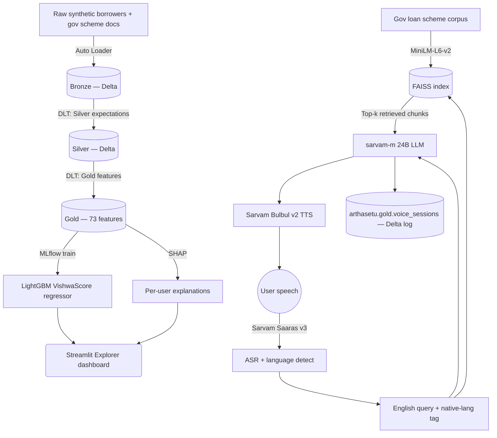

# VishwaScore — Alternative Credit Scoring + Voice Financial Advisor for Bharat

> A full-stack ML + GenAI platform for India's ~300M credit-invisible citizens. VishwaScore combines a **LightGBM alternative credit scorer** trained on 100K synthetic Indian borrowers with a **multilingual voice financial advisor** (Sarvam ASR → FAISS RAG → sarvam-m LLM → Sarvam TTS) that recommends government loan schemes in the user's native language.

[](LICENSE)


**🏆 2nd place — Bharat Bricks Hacks 2026 (₹75,000 prize).**
**🌐 Live app:** https://hello-world-7474647517748637.aws.databricksapps.com

---

## What it does

Two products, one platform:

### 1. VishwaScore — alternative credit score (300–900)

For people with no CIBIL score but a UPI / utility / gov-scheme footprint. The model reads their payment behaviour, digital flow, income stability, and government-scheme participation, then outputs a bureau-style score plus SHAP-based explanations of what drove it.

- **73 engineered features** across payment, digital, income, and identity signals
- **100,000 synthetic Indian borrowers**, **27.3M transactions**, calibrated to NSSO PLFS / NABARD / NPCI / BBPS sources
- **6 India-specific personas** — Farmer, Salaried, Gig Worker, Casual User, Diverse Spender, SHG Woman
- **LightGBM regressor**, tracked in MLflow, registered as `@Champion`
- **Bronze → Silver → Gold** Delta pipeline (DLT for Silver + Gold)
- Explorer dashboard on **Streamlit Cloud**, live-querying Databricks SQL Warehouse

### 2. ArthaSetu voice module — multilingual loan advisor

The user speaks in Hindi / Tamil / Telugu / Marathi / Bengali / Gujarati / Punjabi / Kannada / Malayalam / English. The system detects the language, retrieves the most relevant Indian government loan schemes from a FAISS-indexed knowledge base, generates a warm answer in the user's language with the sarvam-m 24B LLM, and speaks it back with Sarvam Bulbul TTS.

- **Sarvam Saaras v3** ASR → **FAISS RAG** (MiniLM-L6-v2 embeddings) → **sarvam-m 24B** LLM → **Sarvam Bulbul v2** TTS
- **10 Indic languages** supported end-to-end
- **11 government scheme classes** in the knowledge base: PM SVANidhi (all 3 tiers), PMMY Mudra (Shishu / Kishor / Tarun), Kisan Credit Card, NABARD Dairy, SHG Bank Linkage, PM Vishwakarma (both tiers)
- Every voice session is logged to `arthasetu.gold.voice_sessions` (Delta) for later analysis

---

## Results

| Metric | Value | Source |
| --- | --- | --- |
| VishwaScore regression R² | **0.8938** | `vishwascore_streamlit_app.py:342` (footer stat) |
| VishwaScore RMSE | **14.5** | same |
| Training rows | **100,000 users / 27.3M transactions** | same |
| Features | **73 engineered** across 4 categories | `VishwaScore Silver to Gold Features.py` |
| Voice languages | 10 (hi/ta/te/mr/bn/gu/pa/kn/ml/en) | `Voice Ai/constants.py` |
| BhashaBench Financial Q&A accuracy | *evaluation harness in `Voice Ai/Load BhashaBench Data.ipynb`* | pending re-run |

> Latency numbers (p50 / p95 across ASR → RAG → LLM → TTS) are not yet instrumented — that's the top item on the roadmap.

---

## Architecture



---

## Repository layout

The repo currently reflects **two parallel workstreams from the hackathon**, plus my post-hackathon repo-hygiene pass. Nothing has been consolidated yet — see [docs/ROADMAP.md](docs/ROADMAP.md).

```
vishwa-score/
├── VishwaScore Auto Loader Bronze (Streaming).py    # NB — Bronze ingest w/ Auto Loader
├── VishwaScore Bronze to Silver Pipeline.py         # NB — Silver cleaning
├── VishwaScore Silver to Gold Features.py           # NB — 73 features
├── VishwaScore DLT Pipeline (Silver + Gold).py      # DLT pipeline (Silver + Gold)
├── VishwaScore ML Model Training and Prediction.py  # NB — LightGBM train + MLflow
├── vishwascore_streamlit_app.py                     # Streamlit Cloud dashboard
├── DEPLOYMENT_GUIDE.md                              # Streamlit Cloud deploy steps
│
├── Voice Ai/                                        # Voice + RAG module ("ArthaSetu")
│   ├── voice_advisor.py                             # ASR / LLM / TTS wrappers
│   ├── 4_voice_pipeline.py                          # Full ASR → RAG → LLM → TTS pipeline
│   ├── 5_integration_layer.py                       # Combines VishwaScore + voice
│   ├── arthasetu_app.py                             # Standalone Streamlit voice UI
│   ├── arthasetu_integrated_app.py                  # Score + voice unified UI
│   ├── constants.py                                 # Language codes, speakers, paths
│   ├── constants_integrated.py                      # Merged constants for integrated app
│   ├── 2.py / 3.py / Gold.py                        # UC setup, HF/BhashaBench loader
│   ├── Load BhashaBench Data.ipynb                  # BhashaBench eval loader
│   └── silver updated.ipynb                         # Silver refresh
│
├── Xscore/                                          # Earlier XScore branch of the project
│   ├── app/                                         # 4-page Streamlit lending-officer dashboard
│   ├── data/                                        # bronze / silver / gold notebooks
│   └── model/                                       # train / hyperopt / SHAP / refresh
│
├── notebooks/data/                                  # renamed XScore/data (snake_case)
├── notebooks/model/                                 # renamed XScore/model (snake_case)
├── app/                                             # renamed XScore/app (snake_case)
│
├── .env.example                                     # Secrets template
├── pyproject.toml                                   # Package metadata
├── LICENSE                                          # MIT
└── docs/ROADMAP.md                                  # Cleanup + roadmap tracker
```

---

## Run it locally

### 1. Clone and set up

```bash
git clone https://github.com/aryamanbhati/vishwa-score.git
cd vishwa-score

python -m venv .venv
source .venv/bin/activate            # Windows PowerShell: .venv\Scripts\Activate.ps1
pip install -r requirements.txt

cp .env.example .env
# Fill in SARVAM_API_KEY, HF_TOKEN, and the three DATABRICKS_* vars.
```

### 2. Reproduce the data + model on Databricks

Import this repo as a Databricks Git folder (Workspace → Git folders → Add) and run the notebooks in this order (each corresponds to one file at the repo root):

1. `VishwaScore Auto Loader Bronze (Streaming).py` — streams raw synthetic data into Bronze
2. `VishwaScore Bronze to Silver Pipeline.py` — cleans + enforces constraints
3. `VishwaScore Silver to Gold Features.py` — builds the 73-feature Gold table
4. `VishwaScore ML Model Training and Prediction.py` — trains LightGBM, logs to MLflow, registers `@Champion`, writes scores to `workspace.default.vishwascore_dashboard`

`VishwaScore DLT Pipeline (Silver + Gold).py` is the DLT alternative that runs Silver + Gold as a single managed pipeline. Wire it up as a DLT job in the Databricks UI.

### 3. Run the Streamlit dashboard

```bash
streamlit run vishwascore_streamlit_app.py
```

Requires `DATABRICKS_SERVER_HOSTNAME`, `DATABRICKS_HTTP_PATH`, `DATABRICKS_TOKEN` in the environment. See [DEPLOYMENT_GUIDE.md](DEPLOYMENT_GUIDE.md) for deploying to Streamlit Community Cloud.

### 4. Run the voice module

The voice module currently runs inside Databricks (needs the FAISS index at `/Volumes/arthasetu/gold/rag_files/rag.index`). To run locally you'd need to rebuild the index from a scheme corpus and adapt paths — this is on the roadmap.

Standalone Streamlit voice UI: `streamlit run "Voice Ai/arthasetu_app.py"` (after setting `SARVAM_API_KEY`).

---

## Tech stack

**Data & platform (Databricks Data Intelligence Platform)**
Delta Lake · Unity Catalog · Auto Loader · Delta Live Tables (DLT) · Delta Change Data Feed · Databricks Serverless SQL · Databricks Apps

**ML**
LightGBM (regressor) · MLflow (tracking + model registry + `@Champion` alias) · SHAP · scikit-learn · Hyperopt

**RAG**
FAISS · `sentence-transformers/paraphrase-MiniLM-L6-v2` embeddings · state-aware retrieval

**Voice AI (Sarvam AI)**
Saaras v3 ASR (10 Indic languages) · sarvam-m 24B LLM (OpenAI-compatible) · Bulbul v2 TTS · language auto-detect

**App**
Streamlit + Plotly · Databricks SQL Connector (Arrow) · Streamlit Community Cloud deploy target

**Data generation**
PySpark · NumPy / SciPy · Faker (`en_IN`) · deterministic seeding

---

## Where the code lives (quick map)

| I want to see... | Look at |
| --- | --- |
| Feature engineering — the 73 features | `VishwaScore Silver to Gold Features.py` |
| Model training + MLflow | `VishwaScore ML Model Training and Prediction.py` |
| DLT pipeline | `VishwaScore DLT Pipeline (Silver + Gold).py` |
| The RAG + voice pipeline | `Voice Ai/4_voice_pipeline.py` |
| Sarvam ASR / LLM / TTS wrappers | `Voice Ai/voice_advisor.py` |
| The voice Streamlit UI | `Voice Ai/arthasetu_app.py` |
| Score + voice unified UI | `Voice Ai/arthasetu_integrated_app.py` |
| The Explorer dashboard | `vishwascore_streamlit_app.py` |
| The 4-page lending-officer dashboard (earlier version) | `app/app.py` |
| Earlier XScore modelling notebooks | `Xscore/model/` |

---

## Roadmap

Tracked in [docs/ROADMAP.md](docs/ROADMAP.md). Highest priority:

- [ ] **Consolidate the parallel workstreams.** The repo currently has two implementations (XScore + VishwaScore + ArthaSetu). Pick one canonical layout and archive the rest.
- [ ] **Instrument voice-pipeline latency** — p50 / p95 across ASR → retrieval → LLM → TTS.
- [ ] **Refresh the BhashaBench eval numbers** and publish `docs/RAG_EVAL.md` with hit@k, MRR, and LLM-as-judge faithfulness.
- [ ] **Model card** with slice metrics (persona / gender / region) and a fairness audit.
- [ ] **Feature Store registration** — the notebook exists but is empty; wire it to `FeatureEngineeringClient.create_table` on the Gold table.
- [ ] **Databricks Vector Search** — currently we use FAISS locally; migrate the RAG index to Vector Search for prod.
- [ ] Extract notebook logic into `src/vishwascore/` importable modules + pytest CI.

---

## Security

Both the Sarvam API key and Hugging Face token were previously committed to this repo (in `Voice Ai/constants.py` etc.). They have been **revoked** and **purged from all git history** via `git-filter-repo` + force-push. All source files now read secrets from environment variables (see `.env.example`). If you fork this repo, still rotate any keys you find in third-party mirrors — GitHub commit caches can outlive force-pushes.

---

## License

MIT — see [LICENSE](LICENSE).
