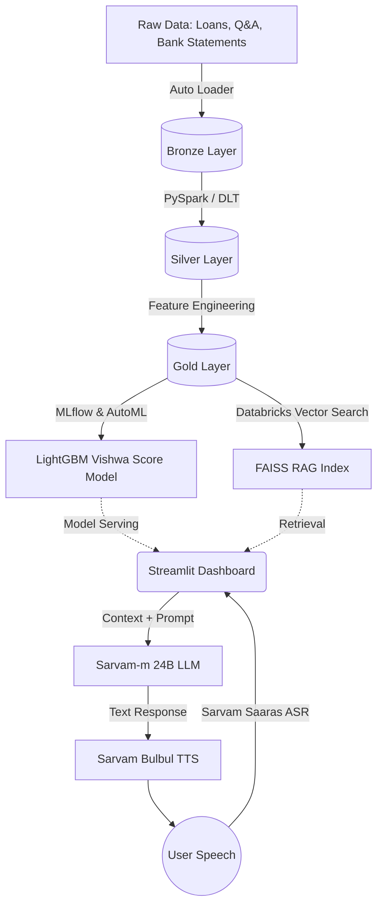

App link ---https://hello-world-7474647517748637.aws.databricksapps.com

# Vishwa Score — Voice Financial Advisor & Alternative Credit Scoring

*Submission for Bharat Bricks Hacks 2026*

## 🎯 What it does
**Vishwa Score** is a multilingual voice-based financial advisory system that helps credit-invisible Indians discover government loan schemes and generates personalized alternative credit scores (Vishwa Score). It leverages the Databricks Data Intelligence Platform and Voice AI to provide native-language financial guidance and ML-driven underwriting for the unbanked.

---
## 🏗️ Architecture Diagram
*How the Databricks components connect to drive the ML and Voice pipeline:*



---

## 🚀 How to Run

Follow these exact commands to reproduce the Databricks environment and run the demo locally.

```bash
# 1. Clone this repository
git clone https://github.com/aryamanbhati/Vishwa Score.git
cd Vishwa Score

# 2. Install Python dependencies
pip install -r requirements.txt

# 3. Authenticate with Databricks Workpace
databricks configure --token

# 4. Ingest Bronze & Silver Data to Unity Catalog
python scripts/1_bronze_ingestion.py
python scripts/2_silver_processing.py

# 5. Build FAISS Index and MLflow Gold Features
python scripts/3_gold_pipeline.py

# 6. Run the App (Requires Sarvam API Key injected in env)
export SARVAM_API_KEY="your_api_key_here"
streamlit run app/main.py
```

---

## 🎥 Demo Steps

To test the application, follow these steps:

1. **Voice Advisory:**
   - Open the deployed Streamlit Dashboard.
   - Click the **Microphone** icon.
   - **Prompt to run (speak):** *"Mujhe apna thela lagane ke liye loan chahiye"* (I need a loan for pushing my street cart).
   - *Expected Action:* The app uses Vector Search to retrieve the PM SVANidhi scheme and plays a native Hindi voice response explaining the loan eligibility.

2. **Vishwa Score Generation:**
   - Navigate to the **"Vishwa Score Underwriting"** tab.
   - Enter a synthetic `user_id` from the Bronze dataset (e.g., `USR-004`).
   - Click **"Calculate Vishwa Score"**.
   - *Expected Action:* It queries the MLflow registered LightGBM model to output a score (300-900) based on their utility/UPI payment history extracted from the Databricks Feature Store.

---

## 🛠️ Technologies Used

- **Databricks Technologies:** 
  - Delta Lake
  - Unity Catalog
  - Databricks Serverless Compute
  - MLflow (Model Tracking & Registry)
  - Databricks Vector Search
- **Open-source Models / Libraries:** 
  - LightGBM (Gradient Boosting)
  - FAISS (Vector Database)
  - `sentence-transformers/paraphrase-MiniLM-L6-v2` (Embeddings)
  - PySpark
- **Voice AI:**
  - Sarvam AI (Saaras v3 ASR, Sarvam-m 24B LLM, Bulbul v2 TTS)

---

## 🏆 Bonus Materials

- **BhashaBench Evaluation Scores:** *[88.4% Accuracy on Financial Q&A]*

---

## 📝 Project Write-up (For Devpost Submission)

**Vishwa Score** brings financial inclusion to 300M credit-invisible Indians. By analyzing alternative data like utility payments, it generates a credible "Vishwa Score" using Databricks MLflow. Additionally, it features a multilingual Voice AI backed by Databricks Vector Search for RAG, allowing rural users to discover government loans just by speaking in their native language. It bridges the gap between formal banking and the unbanked.
