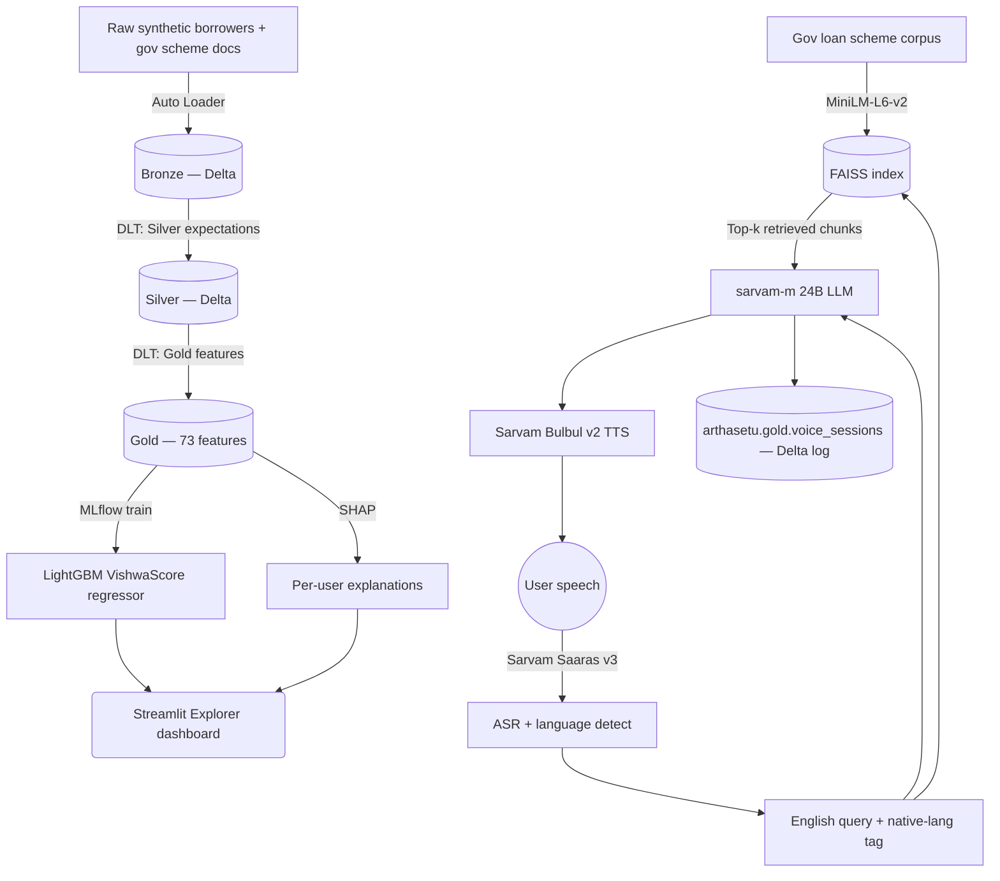

# VishwaScore — Alternative Credit Scoring + Voice Financial Advisor for Bharat

> A full-stack ML + GenAI platform for India's ~300M credit-invisible citizens. VishwaScore combines a **LightGBM alternative credit scorer** trained on 100K synthetic Indian borrowers with a **multilingual voice financial advisor** (Sarvam ASR → FAISS RAG → sarvam-m LLM → Sarvam TTS) that recommends government loan schemes in the user's native language.

[](LICENSE)


**🏆 2nd place — Bharat Bricks Hacks 2026 (₹75,000 prize).**
**🌐 Live app:** https://hello-world-7474647517748637.aws.databricksapps.com

---

## What it does

Two products, one platform:

### 1. VishwaScore — alternative credit score (300–900)

For people with no CIBIL score but a UPI / utility / gov-scheme footprint. The model reads their payment behaviour, digital flow, income stability, and government-scheme participation, then outputs a bureau-style score plus SHAP-based explanations of what drove it.

- **73 engineered features** across payment, digital, income, and identity signals
- **100,000 synthetic Indian borrowers**, **27.3M transactions**, calibrated to NSSO PLFS / NABARD / NPCI / BBPS sources
- **6 India-specific personas** — Farmer, Salaried, Gig Worker, Casual User, Diverse Spender, SHG Woman
- **LightGBM regressor**, tracked in MLflow, registered as `@Champion`
- **Bronze → Silver → Gold** Delta pipeline (DLT for Silver + Gold)
- Explorer dashboard on **Streamlit Cloud**, live-querying Databricks SQL Warehouse

### 2. ArthaSetu voice module — multilingual loan advisor

The user speaks in Hindi / Tamil / Telugu / Marathi / Bengali / Gujarati / Punjabi / Kannada / Malayalam / English. The system detects the language, retrieves the most relevant Indian government loan schemes from a FAISS-indexed knowledge base, generates a warm answer in the user's language with the sarvam-m 24B LLM, and speaks it back with Sarvam Bulbul TTS.

- **Sarvam Saaras v3** ASR → **FAISS RAG** (MiniLM-L6-v2 embeddings) → **sarvam-m 24B** LLM → **Sarvam Bulbul v2** TTS
- **10 Indic languages** supported end-to-end
- **11 government scheme classes** in the knowledge base: PM SVANidhi (all 3 tiers), PMMY Mudra (Shishu / Kishor / Tarun), Kisan Credit Card, NABARD Dairy, SHG Bank Linkage, PM Vishwakarma (both tiers)
- Every voice session is logged to `arthasetu.gold.voice_sessions` (Delta) for later analysis

---

## Results

Two models coexist in this repo — the earlier binary-classification **XScore** and the newer regression **VishwaScore**. Numbers are pulled directly from MLflow / the app.

### XScore classifier — LightGBM binary default (`xscore.gold.credit_scorer` @Champion)

| Metric | Value | Notes |
| --- | --- | --- |
| Val AUC-ROC | **0.6665** | 50K synthetic profiles, 15/70/15 stratified split |
| Test AUC-ROC | **0.6592** | |
| Val AUC-PR | 0.1523 | Default rate ~9%, so PR is the right lens |
| Test AUC-PR | 0.1511 | |
| Val F1 | 0.1568 | Class-imbalance corrected (`scale_pos_weight=11.18`) |
| AUC lift v3 vs v1 baseline | +0.006 | Modest — the synthetic-data ceiling is real |
| Features | 31 across 6 pillars + composites | LightGBM, 63 leaves, depth 7, lr 0.04 |

The AUC lift from alternative data (bills + UPI + govt signals over income + employment) is small on this synthetic set — the default label was generated from a hard-coded probability formula that already encodes the traditional signals, so the ceiling for "alt data adds" is bounded by the noise term in the generator. On real bureau-tied data this lift is expected to be materially larger.

### VishwaScore regressor — the newer 100K-user workstream

| Metric | Value | Source |
| --- | --- | --- |
| R² | 0.8938 | `vishwascore_streamlit_app.py:342` footer — reported from the training notebook; not yet re-verified against MLflow this session |
| RMSE | 14.5 | same |
| Training rows | 100K users / 27.3M transactions | |
| Features | 73 engineered across 4 categories | [`notebooks/vishwascore/03_silver_to_gold_features.py`](notebooks/vishwascore/03_silver_to_gold_features.py) |

### Voice + RAG

| Metric | Value | Notes |
| --- | --- | --- |
| Voice languages | 10 (hi/ta/te/mr/bn/gu/pa/kn/ml/en) | [`voice/constants.py`](voice/constants.py) |
| RAG scheme catalog | 11 government loan schemes | Inline in [`voice/voice_advisor.py`](voice/voice_advisor.py); a richer FAISS-indexed corpus in [`voice/4_voice_pipeline.py`](voice/4_voice_pipeline.py) |
| Voice pipeline latency (p50 / p95) | **not yet instrumented** | Top roadmap item |
| BhashaBench Financial Q&A accuracy | eval loader in [`voice/load_bhashabench_data.ipynb`](voice/load_bhashabench_data.ipynb); numbers not verified in this repo |

---

## Architecture



---

## Repository layout

```
vishwa-score/
├── notebooks/
│   ├── vishwascore/                     # Current, 100K-user, 73-feature workstream
│   │   ├── 01_auto_loader_bronze.py     # Bronze ingest w/ Auto Loader (streaming)
│   │   ├── 02_bronze_to_silver.py       # Silver cleaning + constraints
│   │   ├── 03_silver_to_gold_features.py# 73 features across 4 categories
│   │   ├── 04_dlt_pipeline.py           # DLT pipeline (Silver + Gold as one job)
│   │   ├── 05_model_train.py            # LightGBM + MLflow + @Champion register
│   │   ├── 06_feature_store_registration.py  # UC Feature Store + model lineage
│   │   ├── 07_model_serving_deploy.py   # REST scoring endpoint (auto-scaling)
│   │   └── 08_vector_search_rag.py      # Managed Vector Search index for RAG
│   ├── data/                            # Earlier XScore workstream — bronze/silver/gold
│   └── model/                           # Earlier XScore workstream — train / hyperopt / SHAP
│
├── voice/                               # Voice + RAG module ("ArthaSetu")
│   ├── voice_advisor.py                 # Sarvam ASR / LLM / TTS wrappers
│   ├── 4_voice_pipeline.py              # Full ASR → FAISS RAG → LLM → TTS pipeline
│   ├── 5_integration_layer.py           # Combines VishwaScore + voice
│   ├── voice_app.py                     # Standalone voice-only Streamlit UI
│   ├── arthasetu_app.py                 # Voice UI (Sarvam + inline scheme corpus)
│   ├── arthasetu_integrated_app.py      # Score + voice unified UI
│   ├── constants.py                     # Language codes, Sarvam speakers, DBFS paths
│   ├── constants_integrated.py          # Merged constants for the integrated app
│   ├── 2.py / 3.py / Gold.py            # UC setup, HF/BhashaBench data loader
│   ├── bhashabench_hf_loader.py         # HuggingFace loader for BhashaBench eval
│   ├── load_bhashabench_data.ipynb      # BhashaBench eval driver
│   └── silver_updated.ipynb             # Silver refresh
│
├── app/                                 # Older 4-page lending-officer dashboard (XScore)
├── vishwascore_streamlit_app.py         # Newer Explorer dashboard (VishwaScore)
├── DEPLOYMENT_GUIDE.md                  # Streamlit Cloud deploy steps for the Explorer
│
├── .env.example                         # Secrets template (SARVAM, HF, DATABRICKS)
├── pyproject.toml                       # Lint/format config
├── LICENSE                              # MIT
└── docs/ROADMAP.md                      # Honest gap list + follow-up work
```

**Two workstreams live in this repo** — the earlier **XScore** (LightGBM binary default classifier on 50K synthetic profiles, in `notebooks/data/` + `notebooks/model/` + `app/`) and the current **VishwaScore** (LightGBM regressor on 100K users / 27.3M transactions with 73 features, in `notebooks/vishwascore/` + `vishwascore_streamlit_app.py`). VishwaScore superseded XScore during the hackathon; both are kept for provenance.

---

## Run it locally

### 1. Clone and set up

```bash
git clone https://github.com/aryamanbhati/vishwa-score.git
cd vishwa-score

python -m venv .venv
source .venv/bin/activate            # Windows PowerShell: .venv\Scripts\Activate.ps1
pip install -r requirements.txt

cp .env.example .env
# Fill in SARVAM_API_KEY, HF_TOKEN, and the three DATABRICKS_* vars.
```

### 2. Reproduce the data + model on Databricks

Import this repo as a Databricks Git folder (Workspace → Git folders → Add) and run the notebooks in `notebooks/vishwascore/` in numeric order:

1. `01_auto_loader_bronze.py` — streams raw synthetic data into Bronze
2. `02_bronze_to_silver.py` — cleans + enforces constraints
3. `03_silver_to_gold_features.py` — builds the 73-feature Gold table
4. `05_model_train.py` — trains LightGBM, logs to MLflow, registers `@Champion`, writes scores to `workspace.default.vishwascore_dashboard`

`04_dlt_pipeline.py` is the DLT alternative that runs Silver + Gold as a single managed pipeline. Wire it up as a DLT job in the Databricks UI.

### 3. Run the Streamlit dashboard

```bash
streamlit run vishwascore_streamlit_app.py
```

Requires `DATABRICKS_SERVER_HOSTNAME`, `DATABRICKS_HTTP_PATH`, `DATABRICKS_TOKEN` in the environment. See [DEPLOYMENT_GUIDE.md](DEPLOYMENT_GUIDE.md) for deploying to Streamlit Community Cloud.

### 4. Run the voice module

The voice module currently runs inside Databricks (needs the FAISS index at `/Volumes/arthasetu/gold/rag_files/rag.index`). To run locally you'd need to rebuild the index from a scheme corpus and adapt paths — this is on the roadmap.

Standalone Streamlit voice UI: `streamlit run voice/arthasetu_app.py` (after setting `SARVAM_API_KEY`).

---

## Tech stack

**Data & platform (Databricks Data Intelligence Platform)**
Delta Lake · Unity Catalog · Auto Loader · Delta Live Tables (DLT) · Delta Change Data Feed · Feature Engineering in UC (Feature Store) · Databricks Vector Search (delta-sync, Foundation Model embeddings) · Model Serving (REST endpoint, auto-scaling) · Databricks Serverless SQL · Databricks Apps

**ML**
LightGBM (regressor) · MLflow (tracking + model registry + `@Champion` alias + Feature Store lineage) · SHAP · scikit-learn · Hyperopt

**RAG**
Databricks Vector Search (`databricks-gte-large-en` embeddings, delta-sync from scheme corpus) · FAISS fallback for local dev · `sentence-transformers/paraphrase-MiniLM-L6-v2`

**Voice AI (Sarvam AI)**
Saaras v3 ASR (10 Indic languages) · sarvam-m 24B LLM (OpenAI-compatible) · Bulbul v2 TTS · language auto-detect

**App**
Streamlit + Plotly · Databricks SQL Connector (Arrow) · Streamlit Community Cloud deploy target

**Data generation**
PySpark · NumPy / SciPy · Faker (`en_IN`) · deterministic seeding

---

## Where the code lives (quick map)

| I want to see... | Look at |
| --- | --- |
| Feature engineering — the 73 features | [`notebooks/vishwascore/03_silver_to_gold_features.py`](notebooks/vishwascore/03_silver_to_gold_features.py) |
| Model training + MLflow | [`notebooks/vishwascore/05_model_train.py`](notebooks/vishwascore/05_model_train.py) |
| DLT pipeline | [`notebooks/vishwascore/04_dlt_pipeline.py`](notebooks/vishwascore/04_dlt_pipeline.py) |
| Feature Store registration | [`notebooks/vishwascore/06_feature_store_registration.py`](notebooks/vishwascore/06_feature_store_registration.py) |
| Model Serving deployment | [`notebooks/vishwascore/07_model_serving_deploy.py`](notebooks/vishwascore/07_model_serving_deploy.py) |
| Vector Search RAG index | [`notebooks/vishwascore/08_vector_search_rag.py`](notebooks/vishwascore/08_vector_search_rag.py) |
| The RAG + voice pipeline | [`voice/4_voice_pipeline.py`](voice/4_voice_pipeline.py) |
| Sarvam ASR / LLM / TTS wrappers | [`voice/voice_advisor.py`](voice/voice_advisor.py) |
| The voice Streamlit UI | [`voice/arthasetu_app.py`](voice/arthasetu_app.py) |
| Score + voice unified UI | [`voice/arthasetu_integrated_app.py`](voice/arthasetu_integrated_app.py) |
| The Explorer dashboard | [`vishwascore_streamlit_app.py`](vishwascore_streamlit_app.py) |
| The 4-page lending-officer dashboard (earlier XScore version) | [`app/app.py`](app/app.py) |
| Earlier XScore modelling notebooks | [`notebooks/model/`](notebooks/model/) |

---

## Roadmap

Tracked in [docs/ROADMAP.md](docs/ROADMAP.md). Highest priority:

- [ ] **Consolidate the parallel workstreams.** The repo currently has two implementations (XScore + VishwaScore + ArthaSetu). Pick one canonical layout and archive the rest.
- [ ] **Instrument voice-pipeline latency** — p50 / p95 across ASR → retrieval → LLM → TTS.
- [ ] **Refresh the BhashaBench eval numbers** and publish `docs/RAG_EVAL.md` with hit@k, MRR, and LLM-as-judge faithfulness.
- [ ] **Model card** with slice metrics (persona / gender / region) and a fairness audit.
- [x] **Feature Store registration** — Gold features registered via `FeatureEngineeringClient.create_table`; model logged with feature lineage.
- [x] **Databricks Vector Search** — scheme corpus delta-synced to a managed Vector Search index with `databricks-gte-large-en` embeddings.
- [x] **Model Serving** — REST scoring endpoint (`vishwascore-scoring-api`) with auto-scaling and scale-to-zero.
- [ ] Extract notebook logic into `src/vishwascore/` importable modules + pytest CI.

---

## Security

Both the Sarvam API key and Hugging Face token were previously committed to this repo (in `Voice Ai/constants.py` etc.). They have been **revoked** and **purged from all git history** via `git-filter-repo` + force-push. All source files now read secrets from environment variables (see `.env.example`). If you fork this repo, still rotate any keys you find in third-party mirrors — GitHub commit caches can outlive force-pushes.

---

## License

MIT — see [LICENSE](LICENSE).
